## How to Edit the LabVIEW FPGA IP and re-run the demo on the Arty Artix-7 Board

## Requirements:
* Vivado 2019.1
* LabVIEW 2020

## Clone the Repository
`git clone git@github.com:fpganow/arty_udp.git`

## [1] Start LabVIEW 2020 - not 2020 SP1
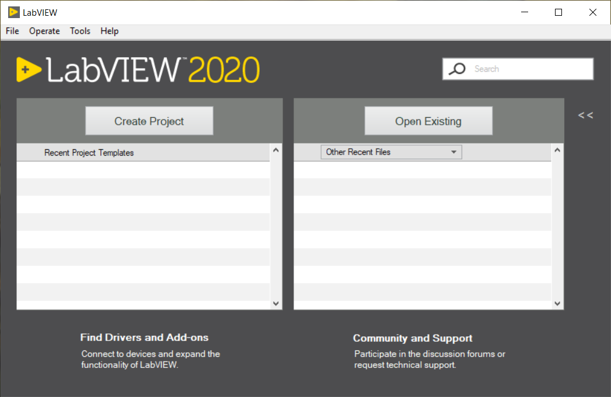

## [2] Select LabVIEW project file 'demo_1.lvproj' (probably will be renamed soon)
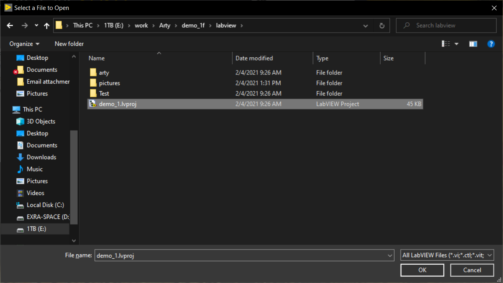

## [3] Take a look at the Test Harness
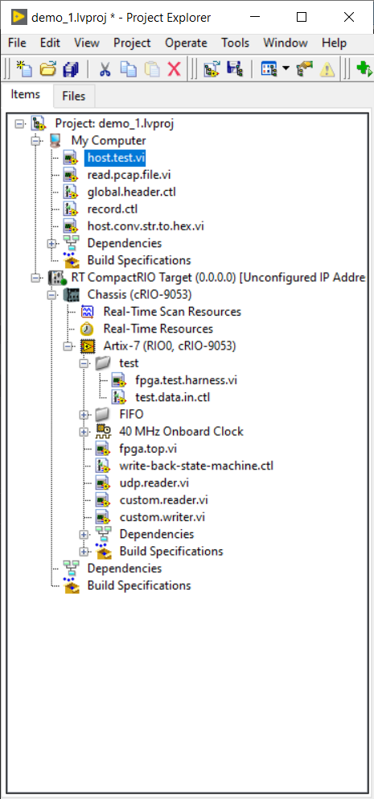

## [4] Make sure you are in FPGA Simulation Mode
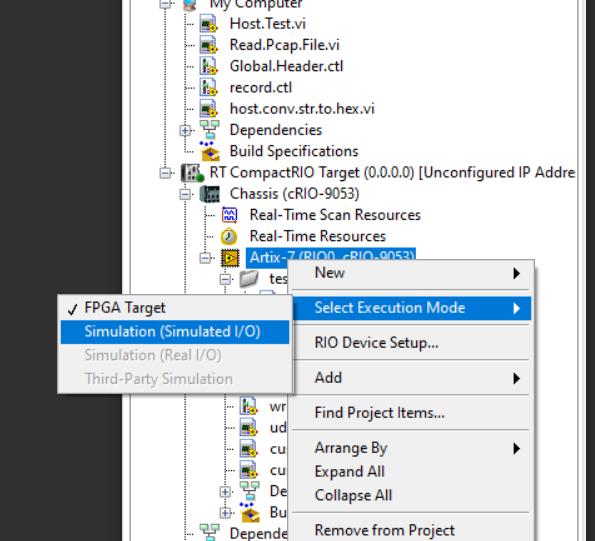

## [5] Look at the String input, it is the same as the output from the MicroBlaze C++ Console.  You can copy the output directly in to this String input.
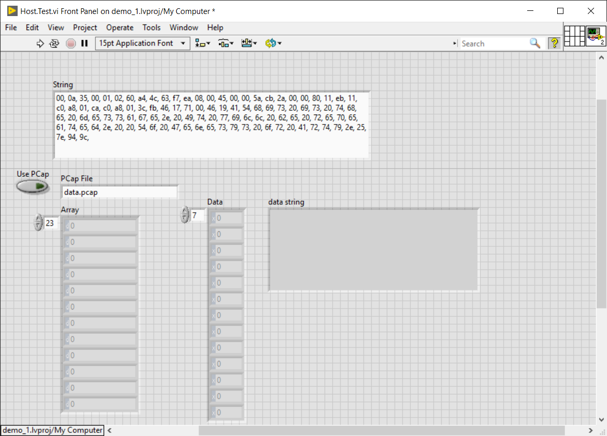

## [6] Run the VI in Simulation mode, and then you will see the decoded UDP payload.  In the following screen shot, you see 4 garbled characteres, these are the CRC of the Ethernet Frame that I have not yet trimmed from the UDP/IP processor.
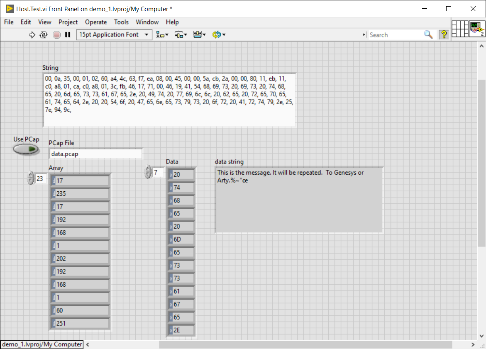

## [7] Take a look at fpga_top.vi
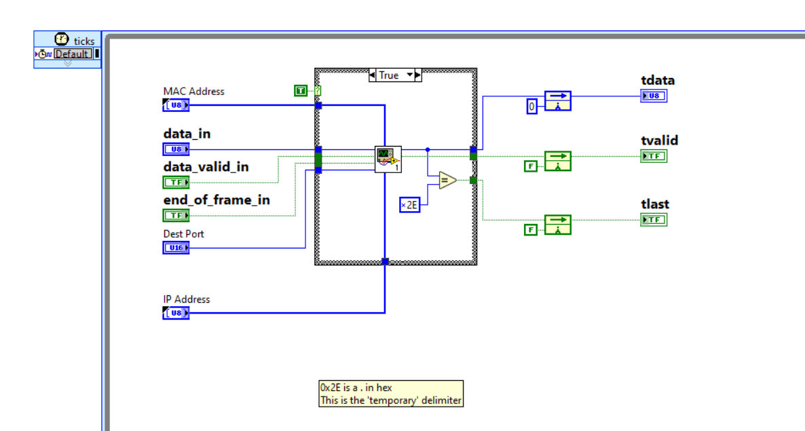

## [8] The only VI is called udp_reader.vi, all the fancy sub-vi's (colored reddish) are part of the LabVIEW Network (UDP/IP) library.
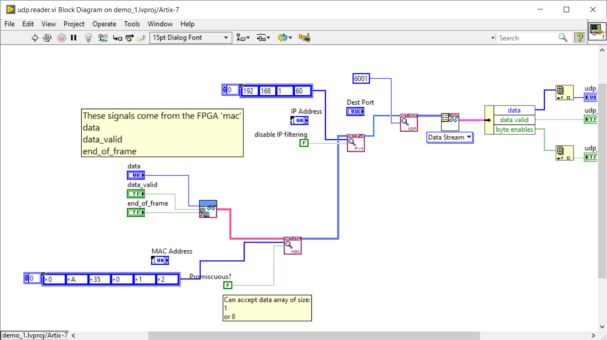

## [9] Now switch back to FPGA Target
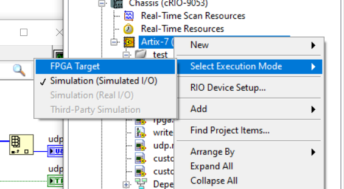

## [10] Right-click on the build specification and select 'Export VI to Netlist File'
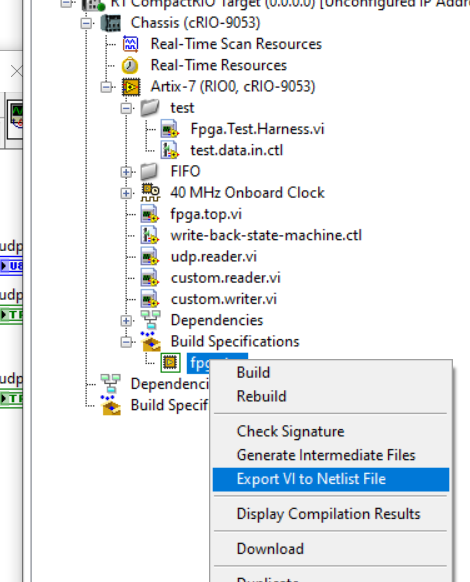

## [11] Pay attention, there is no waiting for you to click 'OK' or 'Finished'
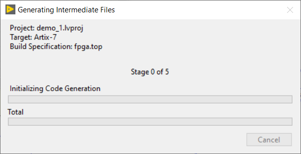

## [12] Browse to the C:\NIFPGA\compilation directory, the newest file (by date/time) is what you want to look at.
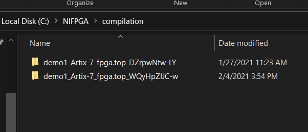

## [13] Copy both the dcp and the vhd file.  The VHD should not have changed unless you made some changes to the controls and indicators on the top level VI.
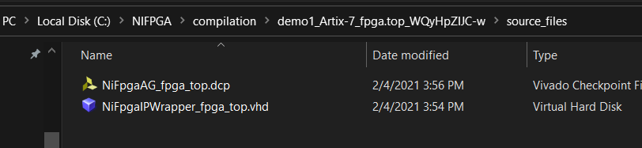

## [14] Yes, overwrite them
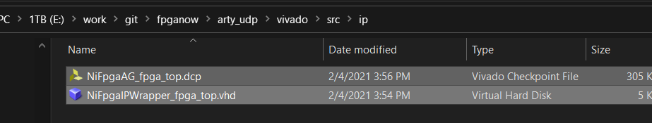

## [15] Run Generate Bitstream
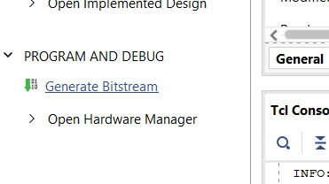

## [16] Export the Hardware
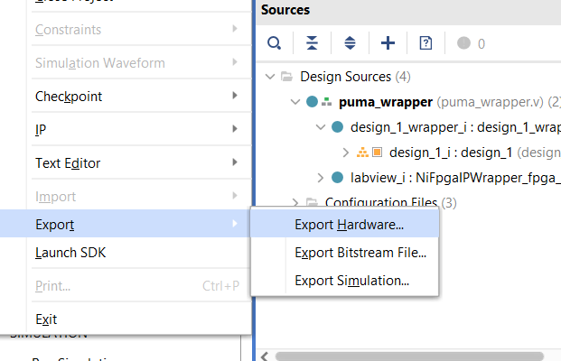

## [17] If your Xilinx SDK is already loaded (as it should be) you will see the following warning
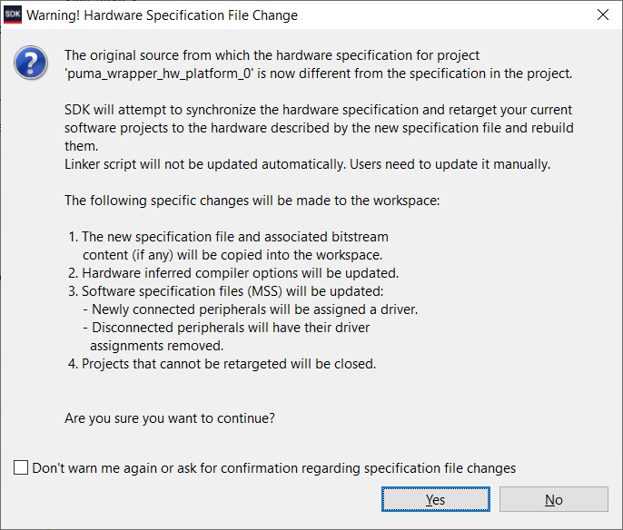

## [18] Re-generate BSP files from the echo_bsp project, the echo project should auto-build and you can run the app with the latest changes made in the FPGA.