## Run Udp/Ip parser on the Arty Artix-7 A100T board.

## Requirements:
* Vivado 2019.1
* LabVIEW 2020

## Clone the Repository
`git clone git@github.com:fpganow/arty_udp.git`

## Start Vivado 2019.1 (You can use later versions, but may run into issues)

## [1] Change to the following directory
`cd {E:\work\Arty\arty_udp\Vivado}`

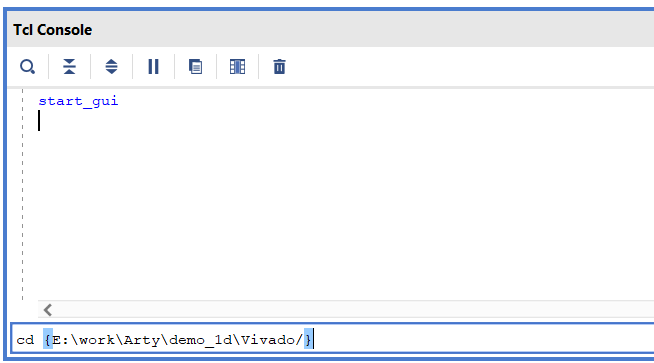

## [2] Source the project script
`source ./a100t_2019_1.tcl`

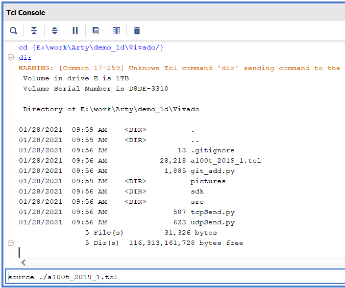

## [3] Generate Output Products
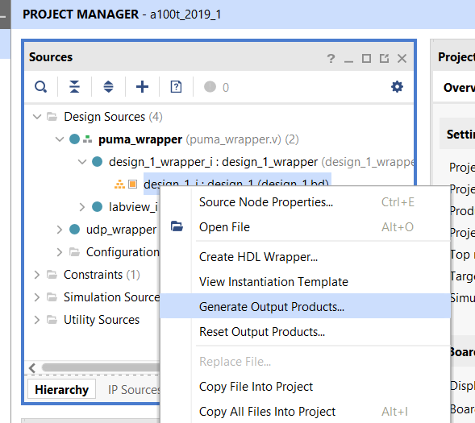

## [4] Generate Bitstream
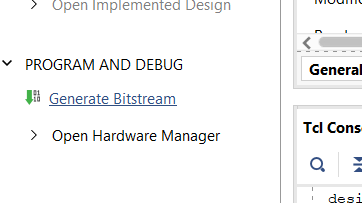

## [5] Export Hardware
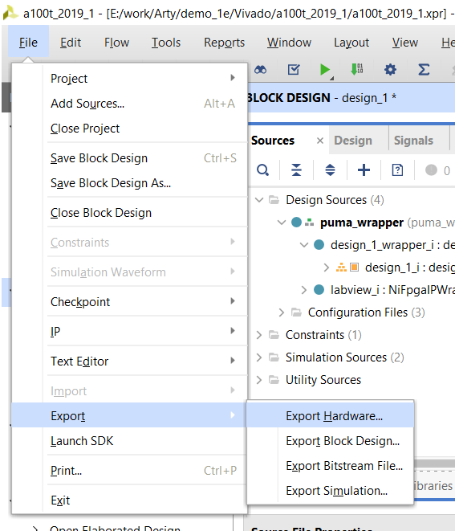

## [6] Export Hardware - include bitstream
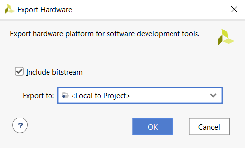

## [7] Start the Xilinx SDK (Software Development Kit)
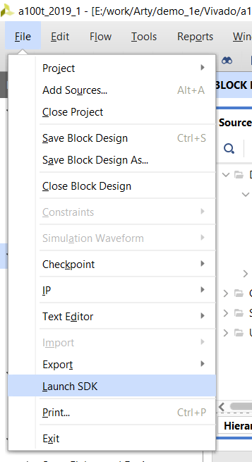

## [8] Default Location is fine
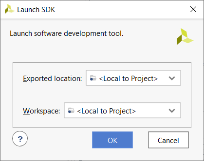

## [9] What it looks like
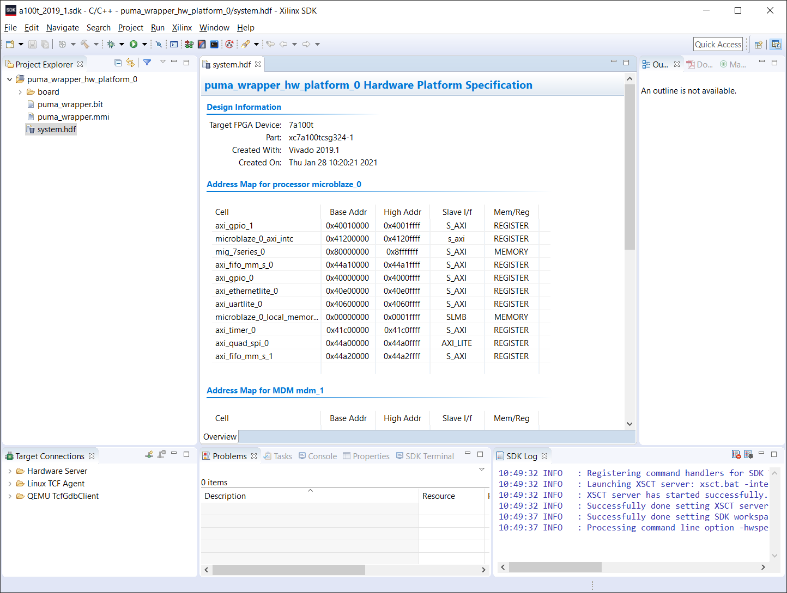

## [10] Create a new Application
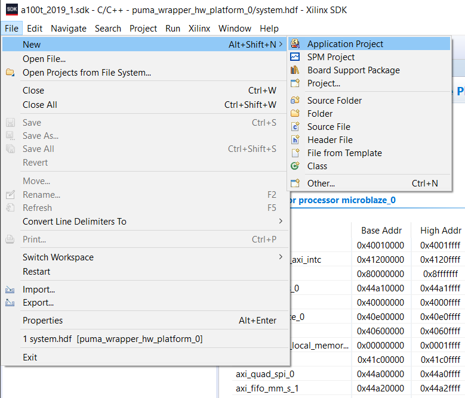

## [11] Press next, not finish
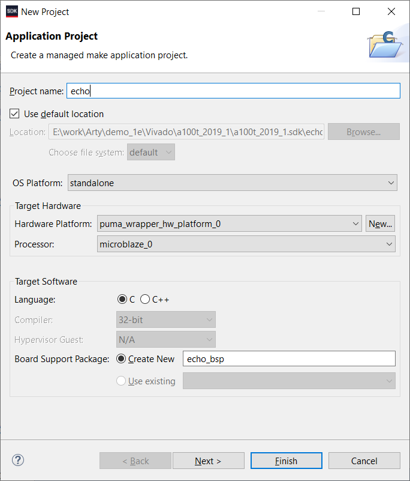

## [12] Select lwIP Echo
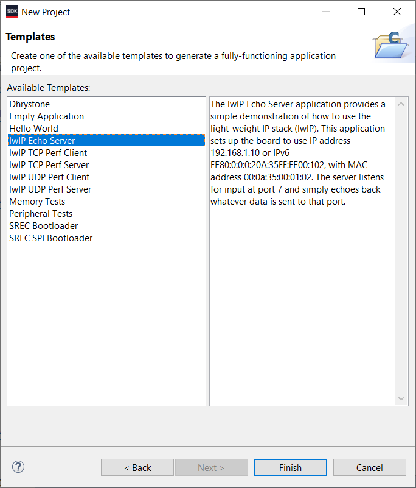

## [13] Here is the default main.c
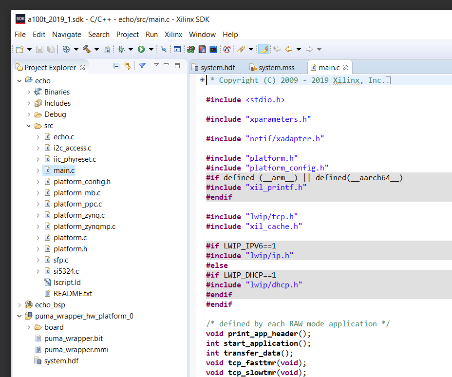

## [14] Copy over the provided main.c (should work in 99% of cases)
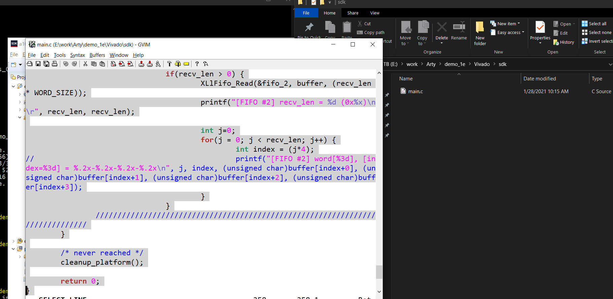

## [15] Make sure the Arty is plugged in and find the COM Port
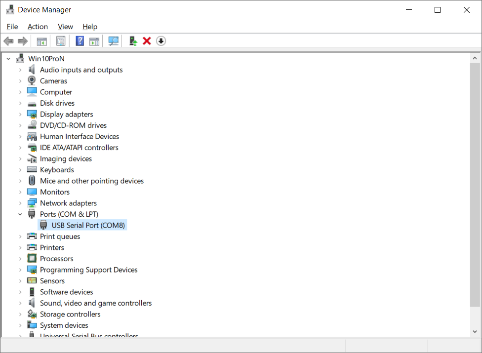

## [16] I use Putty
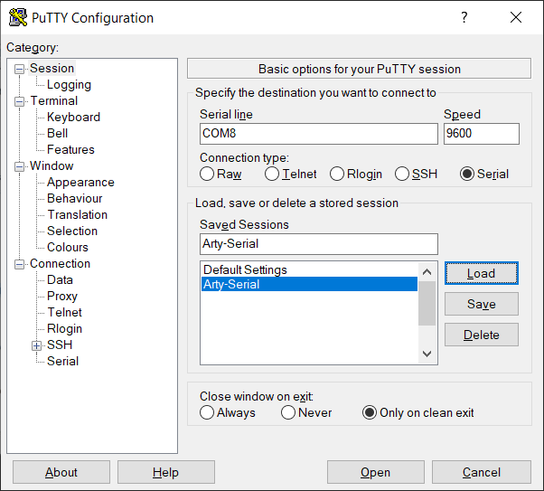

## [17] If you see some text, a connection has been established
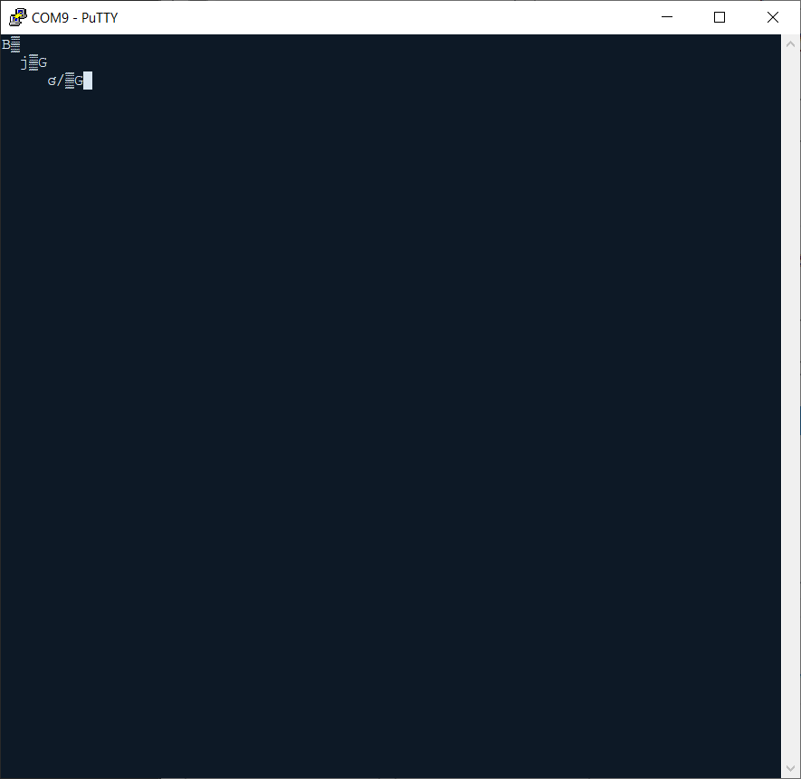

## [18] Program FPGA once
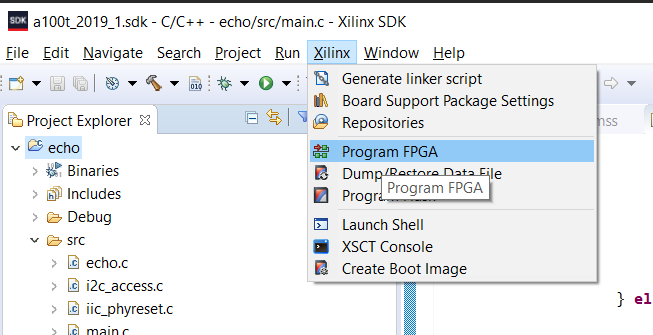

## [19] Default options are fine
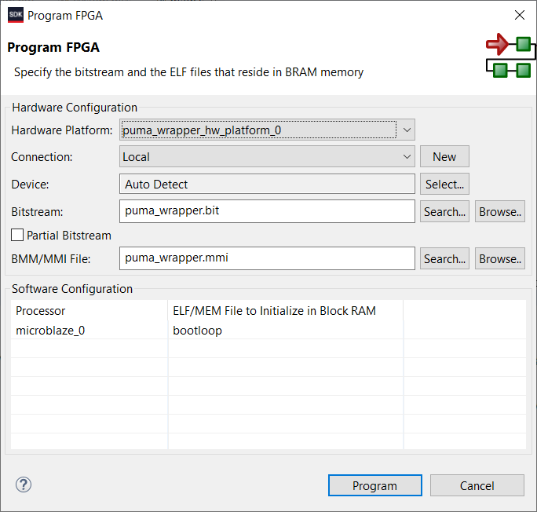

## [20] Progress
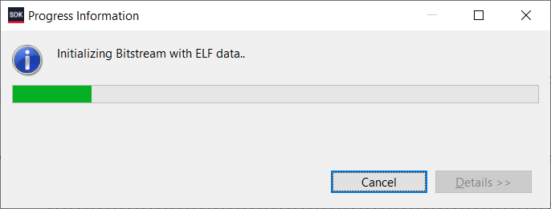

## [21] Start via Run As
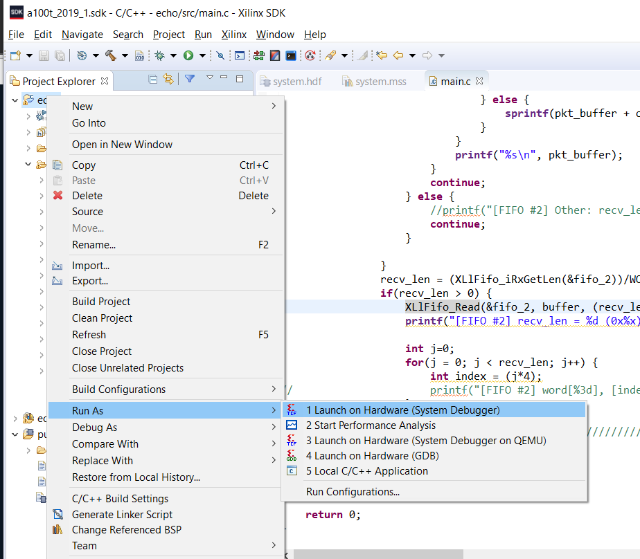

## [22] Once you ping the device, some ARP messages will appear, use udpSend.py to send payload
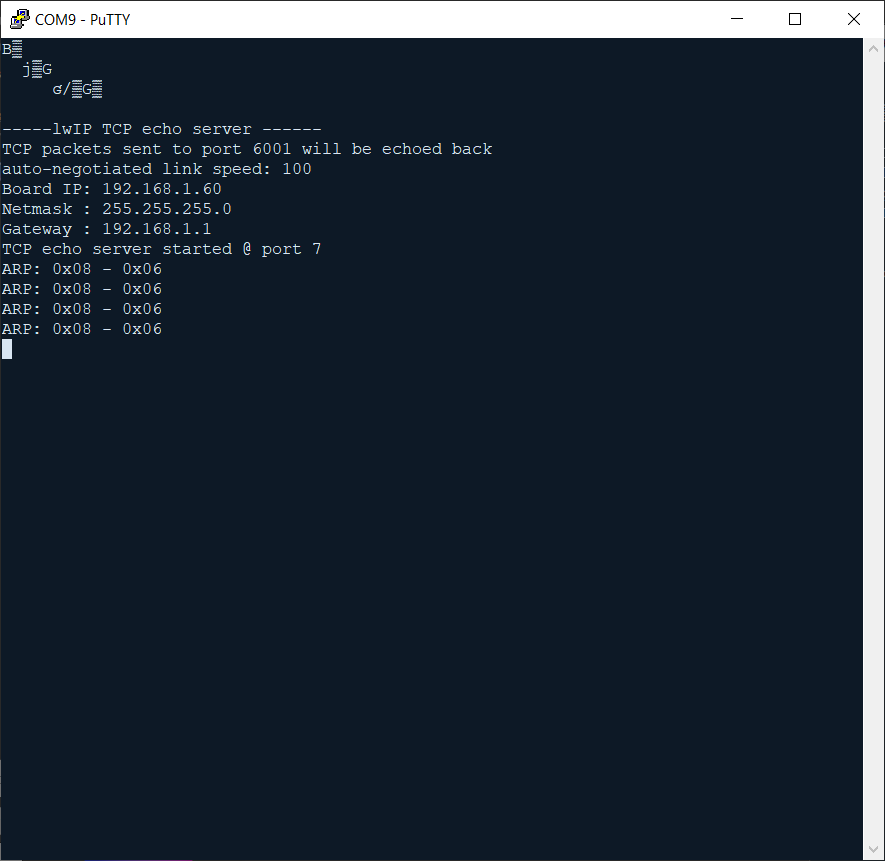
